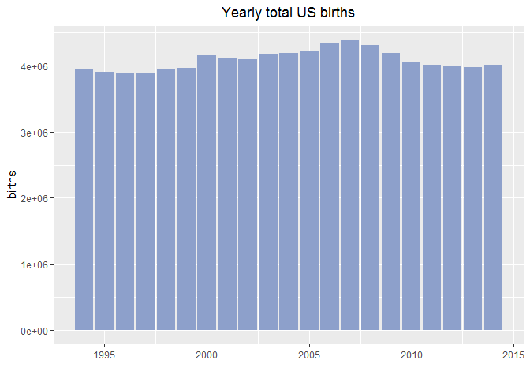
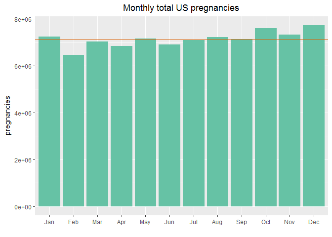
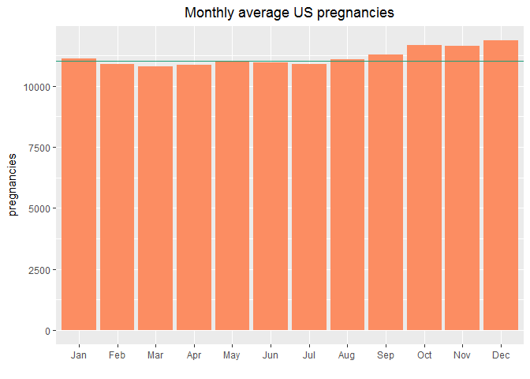
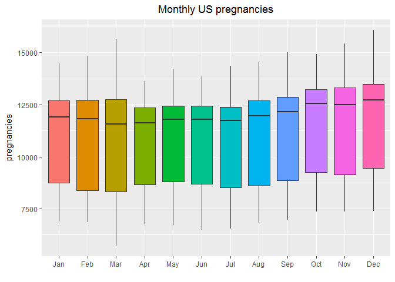
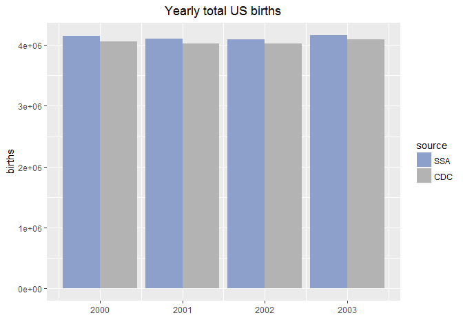
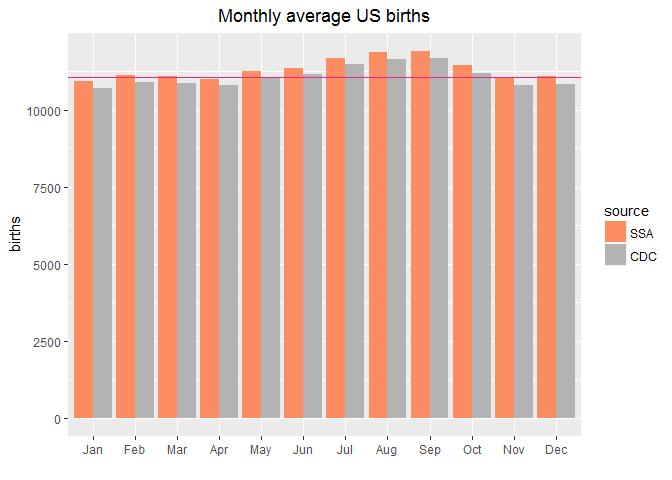
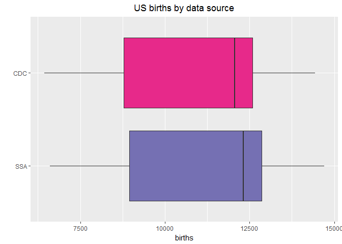

Exploring US Births
================

-   [Summary](#summary)
-   [Prepare the data](#prepare-the-data)
-   [In general, what month(s) encourage more pregnancies?](#in-general-what-months-encourage-more-pregnancies)
-   [Compare number of births from the two sets of data for the years 2000 to 2003 - yearly, monthly](#compare-number-of-births-from-the-two-sets-of-data-for-the-years-2000-to-2003---yearly-monthly)
-   [Conclusion](#conclusion)

Summary
-------

``` r
file_ssa <- "./data/US_births_2000-2014_SSA.csv"
file_cdc <- "./data/US_births_1994-2003_CDC_NCHS.csv"
births2000_2014 <- read.csv(file_ssa)
births1994_2003 <- read.csv(file_cdc)
```

``` r
str(births1994_2003)
```

    ## 'data.frame':    3652 obs. of  5 variables:
    ##  $ year         : int  1994 1994 1994 1994 1994 1994 1994 1994 1994 1994 ...
    ##  $ month        : int  1 1 1 1 1 1 1 1 1 1 ...
    ##  $ date_of_month: int  1 2 3 4 5 6 7 8 9 10 ...
    ##  $ day_of_week  : int  6 7 1 2 3 4 5 6 7 1 ...
    ##  $ births       : int  8096 7772 10142 11248 11053 11406 11251 8653 7910 10498 ...

``` r
summary(births1994_2003)
```

    ##       year          month        date_of_month    day_of_week
    ##  Min.   :1994   Min.   : 1.000   Min.   : 1.00   Min.   :1   
    ##  1st Qu.:1996   1st Qu.: 4.000   1st Qu.: 8.00   1st Qu.:2   
    ##  Median :1998   Median : 7.000   Median :16.00   Median :4   
    ##  Mean   :1998   Mean   : 6.524   Mean   :15.73   Mean   :4   
    ##  3rd Qu.:2001   3rd Qu.:10.000   3rd Qu.:23.00   3rd Qu.:6   
    ##  Max.   :2003   Max.   :12.000   Max.   :31.00   Max.   :7   
    ##      births     
    ##  Min.   : 6443  
    ##  1st Qu.: 8844  
    ##  Median :11615  
    ##  Mean   :10877  
    ##  3rd Qu.:12274  
    ##  Max.   :14540

``` r
str(births2000_2014)
```

    ## 'data.frame':    5479 obs. of  5 variables:
    ##  $ year         : int  2000 2000 2000 2000 2000 2000 2000 2000 2000 2000 ...
    ##  $ month        : int  1 1 1 1 1 1 1 1 1 1 ...
    ##  $ date_of_month: int  1 2 3 4 5 6 7 8 9 10 ...
    ##  $ day_of_week  : int  6 7 1 2 3 4 5 6 7 1 ...
    ##  $ births       : int  9083 8006 11363 13032 12558 12466 12516 8934 7949 11668 ...

``` r
summary(births2000_2014)
```

    ##       year          month        date_of_month    day_of_week
    ##  Min.   :2000   Min.   : 1.000   Min.   : 1.00   Min.   :1   
    ##  1st Qu.:2003   1st Qu.: 4.000   1st Qu.: 8.00   1st Qu.:2   
    ##  Median :2007   Median : 7.000   Median :16.00   Median :4   
    ##  Mean   :2007   Mean   : 6.523   Mean   :15.73   Mean   :4   
    ##  3rd Qu.:2011   3rd Qu.:10.000   3rd Qu.:23.00   3rd Qu.:6   
    ##  Max.   :2014   Max.   :12.000   Max.   :31.00   Max.   :7   
    ##      births     
    ##  Min.   : 5728  
    ##  1st Qu.: 8740  
    ##  Median :12343  
    ##  Mean   :11350  
    ##  3rd Qu.:13082  
    ##  Max.   :16081

Prepare the data
----------------

First of all, we should visually check to see if the number of babies born match for dates between 2000 and 2003.

``` r
head(subset(births1994_2003, year = 2003), n=3); head(subset(births2000_2014, year = 2003), n=3)
```

    ##   year month date_of_month day_of_week births
    ## 1 1994     1             1           6   8096
    ## 2 1994     1             2           7   7772
    ## 3 1994     1             3           1  10142

    ##   year month date_of_month day_of_week births
    ## 1 2000     1             1           6   9083
    ## 2 2000     1             2           7   8006
    ## 3 2000     1             3           1  11363

``` r
head(subset(births1994_2003, year = 2002), n=3); head(subset(births2000_2014, year = 2002), n=3)
```

    ##   year month date_of_month day_of_week births
    ## 1 1994     1             1           6   8096
    ## 2 1994     1             2           7   7772
    ## 3 1994     1             3           1  10142

    ##   year month date_of_month day_of_week births
    ## 1 2000     1             1           6   9083
    ## 2 2000     1             2           7   8006
    ## 3 2000     1             3           1  11363

``` r
head(subset(births1994_2003, year = 2000), n=3); head(subset(births2000_2014, year = 2000), n=3)
```

    ##   year month date_of_month day_of_week births
    ## 1 1994     1             1           6   8096
    ## 2 1994     1             2           7   7772
    ## 3 1994     1             3           1  10142

    ##   year month date_of_month day_of_week births
    ## 1 2000     1             1           6   9083
    ## 2 2000     1             2           7   8006
    ## 3 2000     1             3           1  11363

Clearly the birth numbers vary. We'll merge the dataframes using only the SSA data where the dates intersect (2000 to 2003).

``` r
births_all <- rbind(births2000_2014, subset(births1994_2003, year < 2000))
```

In general, what month(s) encourage more pregnancies?
-----------------------------------------------------

Investigate patterns related to when (months, seasons) people decide to get pregnant.

It would be nice to find out if most people generally get pregnant in the late fall early winter months as that is the general belief. To keep things simple, we'll assume that all pregnancies last exactly 40 weeks.

``` r
# load libraries
source("packages.R")

year_str <- as.character(births_all$year)
month_str <- as.character(births_all$month)
date_str <- as.character(births_all$date_of_month)
full_date_str <- paste0(year_str, '/', month_str, '/', date_str)
births_all$pregnancy_start <- ymd(full_date_str) - weeks(40)

plot_colours <- brewer.pal(8, "Set2")   # for bar plots
boxplot_colours <- brewer.pal(9, "YlGn")   # for monthly boxplots
other_colours <- brewer.pal(4, "Dark2")   #
```

``` r
### yearly total births
yearly_births <- births_all %>% group_by(year) %>% summarize(total_births = sum(births))

ggplot(yearly_births, aes(year, total_births)) +
     geom_bar(stat = "identity", fill=plot_colours[3]) + 
     labs(y="births", x="", title="Yearly total US births") +
     theme(plot.title = element_text(hjust = 0.5))   # center the tile
```



``` r
births_all$month_lab <- month(births_all$pregnancy_start, label = TRUE)

### Total pregnancies - by month, from 1994 to 2014.
monthly_births <- births_all %>% group_by(month_lab) %>% summarize(total_births = sum(births))

ggplot(monthly_births, aes(month_lab, total_births)) +
     geom_bar(stat = "identity", fill=plot_colours[1]) + 
     geom_hline(aes(yintercept=median(total_births)), colour=other_colours[2]) +   # median line
     labs(y="pregnancies", x="", title="Monthly total US pregnancies") + 
     theme(plot.title = element_text(hjust = 0.5))   # center the tile
```



``` r
### Average number of monthly pregnancies
avg_monthly_births <- births_all %>% group_by(month_lab) %>% summarize(avg_births = mean(births))
avg_monthly_median <- median(avg_monthly_births$avg_births)

ggplot(avg_monthly_births, aes(month_lab, avg_births)) +
     geom_bar(stat = "identity", fill=plot_colours[2]) + 
     geom_hline(aes(yintercept=avg_monthly_median), colour=other_colours[1]) +   # median line
     labs(y="pregnancies", x="", title="Monthly average US pregnancies") + 
     theme(plot.title = element_text(hjust = 0.5))   # center the tile
```



``` r
ggplot(births_all, aes(month_lab, births, fill=month_lab)) +
     geom_boxplot() +
     guides(fill=FALSE) +
     labs(y="pregnancies", x="", title="Monthly US pregnancies") +
     theme(plot.title = element_text(hjust = 0.5))   # center the tile
```



There is a gradual increase in the number of pregnanices as we go from summer to autumn/fall. Looking at the average monthly plot, the fall and winter months (September to January) are the highest above the median line. The average for May is higher than the expected trend, relative to April and June. This could be explained by the fact that some professions, for example teachers, do not have an extended vacation any other time of year.

The monthly boxplots seem to confirm the general trend of increasing pregnancies starting around August and peaking in December.

Compare number of births from the two sets of data for the years 2000 to 2003 - yearly, monthly
-----------------------------------------------------------------------------------------------

This will highlight the general pattern of the birth numbers from both data sets

``` r
df1 <- subset(births2000_2014, year < 2004)
names(df1) <- paste0(names(df1), "_1")
df2 <- subset(births1994_2003, year > 1999)
names(df2) <- paste0(names(df2), "_2")

births_intersection <- cbind(df1, df2)   
```

``` r
# merge columns, cleanup
year_eq <- all(births_intersection$year_1 == births_intersection$year_2)
month_eq <- all(births_intersection$month_1 == births_intersection$month_2)
month_date_eq <- all(births_intersection$date_of_month_1 == births_intersection$date_of_month_2)
if (year_eq) {
     births_intersection$year_2 <- NULL
}
if (month_eq) {
     births_intersection$month_2 <- NULL
}
if (month_date_eq) {
     births_intersection$date_of_month_2 <- NULL
     births_intersection$day_of_week_2 <- NULL
}

rm(year_eq, month_eq, month_date_eq, df1, df2)

# rename columns, reshape data, cleanup
names(births_intersection)[1:4] <- sub("_1", '', names(births_intersection)[1:4])
names(births_intersection)[5] <- "SSA"
names(births_intersection)[6] <- "CDC"

births_intersection <- melt(births_intersection, id.vars = 1:4, 
                            variable.name = "source", value.name = "births")
head(births_intersection)
```

    ##   year month date_of_month day_of_week source births
    ## 1 2000     1             1           6    SSA   9083
    ## 2 2000     1             2           7    SSA   8006
    ## 3 2000     1             3           1    SSA  11363
    ## 4 2000     1             4           2    SSA  13032
    ## 5 2000     1             5           3    SSA  12558
    ## 6 2000     1             6           4    SSA  12466

``` r
tail(births_intersection)
```

    ##      year month date_of_month day_of_week source births
    ## 2917 2003    12            26           5    CDC  10218
    ## 2918 2003    12            27           6    CDC   8646
    ## 2919 2003    12            28           7    CDC   7645
    ## 2920 2003    12            29           1    CDC  12823
    ## 2921 2003    12            30           2    CDC  14438
    ## 2922 2003    12            31           3    CDC  12374

``` r
year_str <- as.character(births_intersection$year)
month_str <- as.character(births_intersection$month)
date_str <- as.character(births_intersection$date_of_month)
full_date_str <- paste0(year_str, '/', month_str, '/', date_str)
births_intersection$full_date <- ymd(full_date_str)
births_intersection$month_lab <- month(births_intersection$full_date, label = TRUE)

rm(year_str, month_str, date_str, full_date_str)
```

``` r
### compare yearly total births
yearly_births_2 <- births_intersection %>% group_by(year, source) %>% summarize(total_births = sum(births))
ggplot(yearly_births_2, aes(year, total_births, fill=source)) +
     geom_bar(stat = "identity", position = position_dodge()) + 
     scale_fill_manual(values=plot_colours[c(3,8)]) +
     labs(y="births", x="", title="Yearly total US births") +
     theme(plot.title = element_text(hjust = 0.5))   # center the tile
```



``` r
### compare avearge monthly total births
avg_monthly_births_2 <- births_intersection %>% group_by(month_lab, source) %>%
     summarize(avg_births = mean(births))
ggplot(avg_monthly_births_2, aes(month_lab, avg_births, fill=source)) +
     geom_bar(stat = "identity", position = position_dodge()) + 
     scale_fill_manual(values=plot_colours[c(2,8)]) +
     geom_hline(aes(yintercept=avg_monthly_median), colour=other_colours[4]) +   # median line
     labs(y="births", x="", title="Monthly average US births") +
     theme(plot.title = element_text(hjust = 0.5))   # center the tile
```



``` r
ggplot(births_intersection, aes(source, births, fill=source)) +
     geom_boxplot() + coord_flip() +
     guides(fill=FALSE) +
     scale_fill_manual(values = other_colours[3:4]) +
     labs(y="births", x="", title="US births by data source") +
     theme(plot.title = element_text(hjust = 0.5))   # center the tile
```



It looks like the birth numbers from the SSA are consistently higher than those from the CDC. This might be worth further investigation.

Conclusion
----------

There is noticeable increase in pregnancies that start in the fall or early winter months. A lot of the this increase is witnessed in the months of October, November, and December.
